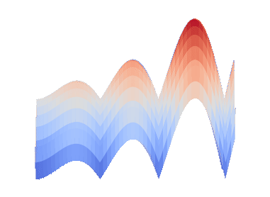
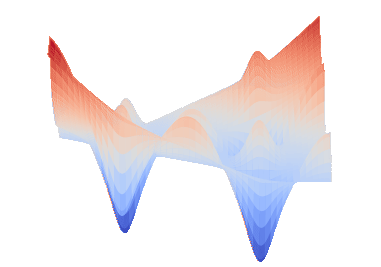
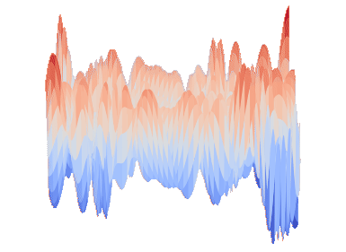

# CORNN - Continuous Optimisation of Regression tasks using Neural Networks

CORNN is easy to use benchmark suit, which is focused on the task of optimizing neural network weights using population based approaches on large array of regression tasks.

The CORNN benchmark suit is constructed from 54 classic real-valued functions from the field of continuous optimization, from which the regression data sets have been generated by uniformly sampling the active domains each classic function. For each function a training set and test set of 3750 and 1250 are provided.
A CORNN problem instance is generated by pairing a regression data set with specific neural network architecture. In the case of CORNN there are 6 architectures provided to you. Resulting in 324 unique problem instances within the CORN benchmark suite.

The goal of each problem instance is to try and improve the model fit by optimization of the NN weights for a given dataset. A full motivation for this benchmark suits, and a demonstration of utilizing it to compare a number of optimization algorithms is give in the article: [arXiv ref], which is currently under review at the IEEE Transactions on Evolutionary Computation journal.


## Features
- Pure Python 3 implementation
- Windows, Linux, and Mac OS supported
- Rapid candidate solution evaluation due to the PyTorch backend
- 324 unique problem instances 
- Simple to use interface, with both the neural network computation and dataset processing abstracted away
- Additional neural network architecture and can be easily be added
- All 54 regression task generating functions have also been provided

## Using the CORNN benchmark suite
The CORRN benchmark suite is designed using Python 3 and relies on PyTorch for highly efficient candidate solution evaluation. In order to construct one of the 324 problem instances an underlying regression task and a model architecture must be selected from the library. Once this pair has been selected the library will construct a problem instance object with a callable function from which the user can simply pass a candidate solution to for evaluation.

The following code snippet is also present in 'Demo.py', and should serve as a straight forward guide of how to use the benchmark suite. 
```py
function_dictionary=CORNN.get_benchmark_functions()
# Returns a dictionary of all the regression functions within CORNN
# The key is the function name, the value is a 3 element tuple:
# containing the raw objective function (for example the Ackley function) and
# the x variable's domain and the y variable's domain

print([*function_dictionary.keys()])
# list all the available objective functions.

training_data, test_data= CORNN.get_scaled_function_data(function_dictionary["Ackley"])
# Both the training data and the test data are pairs. 
# The first element of training_data is an PyTorch tensor of data patterns
# The second element of training_data is a PyTorch tensor of the corresponding labels
# The same is true for test_data

neural_network_dictionary=CORNN.get_NN_models()
# Returns a dictionary of all neural network architecture from CORNN
# The key is the class name, the value is the NN class built on PyTorch. 

print([*neural_network_dictionary.keys()])
# list all the available neural network architecture.

neural_network_architecture=neural_network_dictionary["Net_5_relu_layers"]() # the () to instantiate 
# Selects the 3 hiddern layer NN model that uses ReLU activation function within
# the Hiddern layers. 

# The combination of training_data, test_data, and the 
# selected neural network architecture makes a problem instance of CORNN
CORNN_benchmark_instance=CORNN.NN_Benchmark(training_data,test_data,neural_network_architecture)
instance_dimension= CORNN_benchmark_instance.get_weight_count()

example_candidate_solution=np.random.rand(instance_dimension)

# In order to evaluate a candidate solution on the training set simply use:
training_loss=CORNN_benchmark_instance.training_set_evaluation(example_candidate_solution)
print("Training set loss:",training_loss)

# In order to evaluate a candidate solution on the training set simply use:
testing_loss=CORNN_benchmark_instance.testing_set_evaluation(example_candidate_solution)
print("Testing set loss:",testing_loss)
```


## Underlying Functions
The CORNN suite provides data sets (both test and train) for 54 functions, as detailed in [arXiv ref].To provide a taste, below is the Alpine N.1, Bird, Egg Holder, and Himmelblau plotted in 3D.






## Dependencies
The benchmark suite makes use of numpy, panda, and [PyTorch](https://pytorch.org/). The minimum version numbers are stored in requirements.txt file and are:
```
numpy==1.20.1
pandas==1.2.3
torch==1.9.0
```

## Installation
You can simply download the lib folder an use as indicated in 'demo.py' file or if you wish to install CORRN as a package you can enter the below commands:

```
git clone https:///github.com/CWCleghornAI/CORNN
cd CORNN
python3 setup.py install
```
## Licensing
GNU General Public License v3.0 details can be found [here](LICENSE.txt) 

## Improving CORRN
If you encounter any bugs or see possible improvements, please open an issue or feel free to make a pull request.